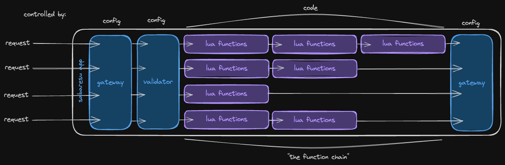

# 🐟 sabaresu (WIP)
No mackerels needed. Bad puns withstanding, sabaresu is a "serverless framework" proof of concept.


### But why?
I love the DX of serverless but I'm not a fan of vendor lock-in and the financial implications for the small/hobby projects I often want to use it in.

Under the hood, `sabaresu` is just a Go web application that routes HTTP requests to a chain of [Lua](https://www.lua.org/) functions which pass along a response object.



You can quickly deploy it like any other horizontally-scaled containerized application; but then change functions on the fly as needed.


### Features
- Simple DX
  - Up and running in < 1 Minute
  - Schema based validation ensures you get the right input
  - Schema based sweeping ensures you send the right output
  - Powerful function chaining concept allows you to divide out business logic work flows.
- Easily scaled; works like any other containerized GoLang Web App


TODO:
- Full hot deployments (only functions are HOT atm)
- Deployment Strategies ?? / support deploy strategies for new functions Canary/Blue-Green ?
  - Probably just versioning is better
- Easy function testing/simulation

## Getting Started
Initialize a new project template to a `tmp` folder:
```shell
cd tmp && ./sabaresu init
```

Build `sabaresu` binary:
```shell
go build -o tmp/sabaresu cmd/sabaresu/main.go
```

Run your server:
```shell
./tmp/sabaresu run
```

Optional Params:
```shell
./sabaresu run --cfg="./file.toml" --port="./functions"
```


### `gateway.toml`

sabaresu exposes functions over HTTP as defined in your `gateway.toml`. The gateway confiugration follows a simple mental model:

```toml
[[routes]]
method = "GET" # HTTP Method
path = "/v1/test" # Path
functions = ["hello-world.lua"]

[[routes]]
method = "GET"
path = "/v1/user/{test}" # Path with Parameter
functions = ["auth.lua", "hello-world.lua"] # Chained functions
```

Chaining is an expressive way to isolate parts of your application logic while also providing a "middleware" like experience.

For example, we can always run `auth.lua` first on requests. If it fails we can abort the request early. If it succeeds we can pass some auth state or context to the next function.


### Schema
`sabaresu` utilizes schema written in TOML to define the request life cycle and even the expected output.

This allows you to validate user input and also sweep your output- a term we've coined to mean cleaning your output of anything not defined, preventing accidental leaks. `sabaresu` will sweep any unexpected output under the rug before it makes it out of your service.

This looks like:

```toml
[path] # Validation of path params
enterprise_id = "string,required,uuid"

[query] # Validation of query params
limit = "number,int"

[body] # Validation of request body
name = "string,required,min=1,max=128"

[body.org_info]
id = "string,required,uuid"
name = "string,required,min=1,max=128"

[response] # Definition of the response
id = "string,required,uuid"
enterprise_id = "string,required,uuid"
name = "string,required,min=1,max=128"

[response.org_info]
id = "string,required,uuid"
name = "string,required,min=1,max=128"
```

You can set a schema on any endpoint to take advantage of validation and sweeping.


### Functions

A sabaresu function must have define a `main` function that recieves two parameters, `request` & `response`. For example:

```lua
function main(request, response)
    print(request.id)
    print("Hello " .. request.getPathParam("name") .. "!")
    return resp
 end
```


#### request
`request` is a table that describes the original HTTP request recieved by the gateway.  Immutable between requests.

| key | type | description |
| ---- | ---- | ---- |
| `id` | string | A unique `UUIDv4` for the the request |
| `method` | string | The HTTP Method of the request |
| `headers` | table[string][]string | A table of headers on the request |
| `url` | string | The full URL|
| `host` | string | The host value |
| `path` | string | The request path |
| `getPathParam ` | function(name string) string or nil | Retrieves a path parameter by name |
| `queryParams` | table[string][]string | A table of query params on the request |


#### response
`response` is a table that defines how the final response will be sent after the last function is run. It is mutable between functions.

| key | type | description | default |
| ---- | ---- | ---- |  ---- |
| `statusCode` | number | HTTP Status Code | 200 |
| `headers` | table[string][]string | Headers to set on response | {} |
| `payload` | table[string]any | A private payload to pass info between functions| {}
| `body` | table[string]any | The response body that will be serialized | {} |


## Runtime API

In addition to request handling basics, some helpers and go bindings are also globaly available for usage.

